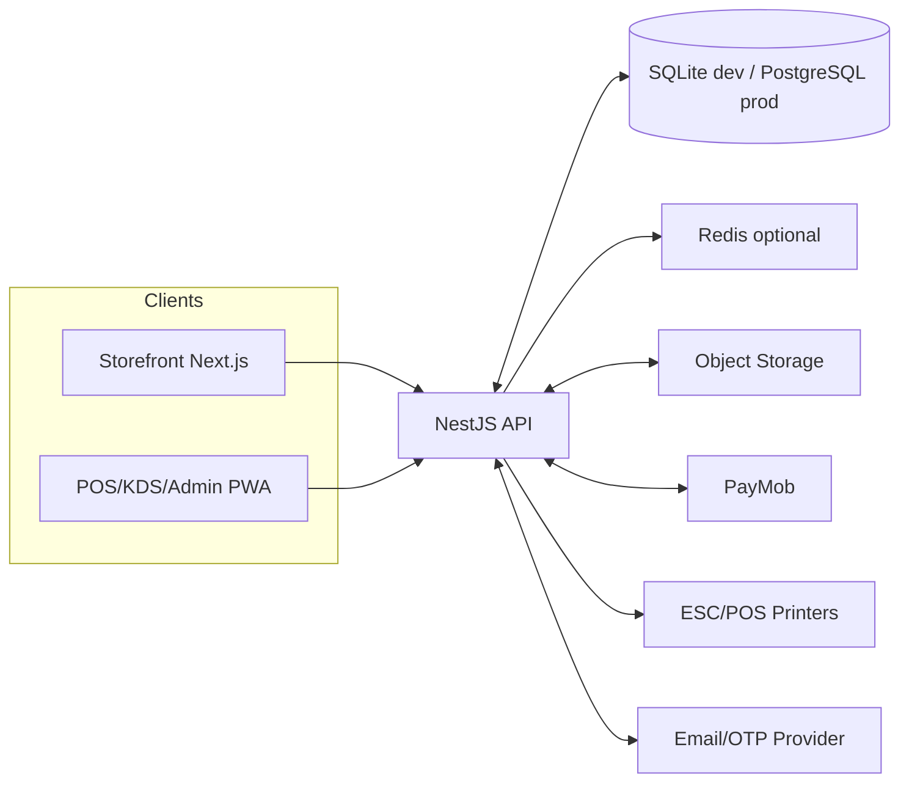
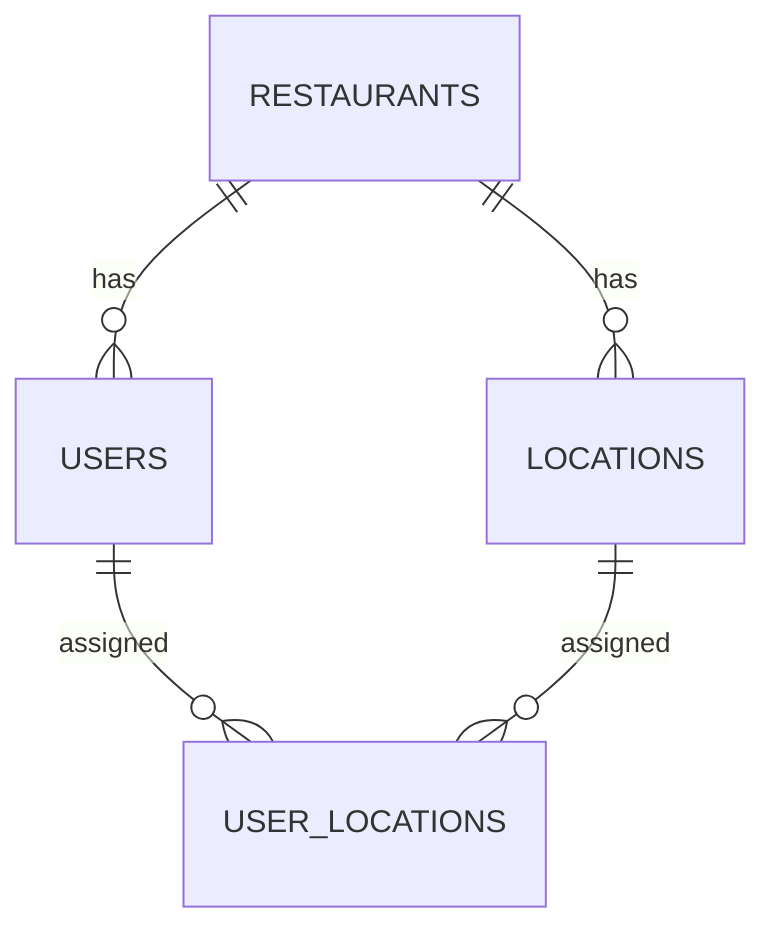
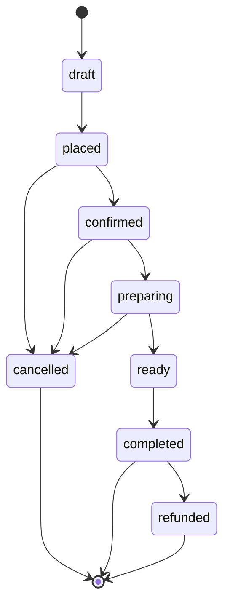
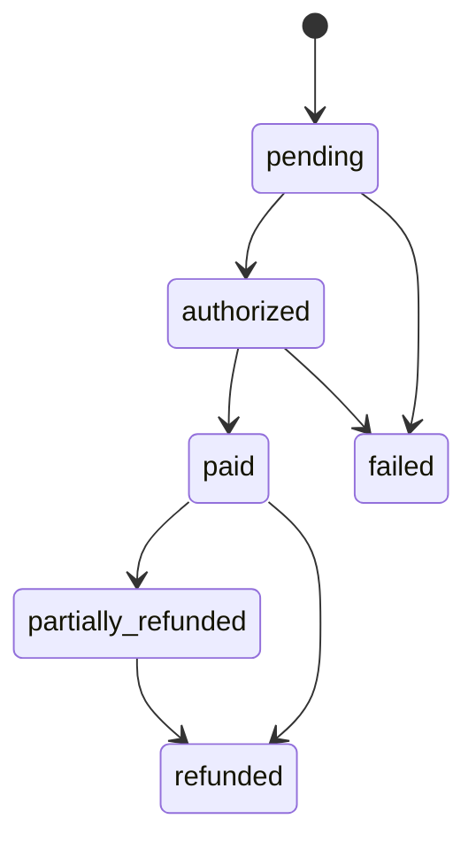
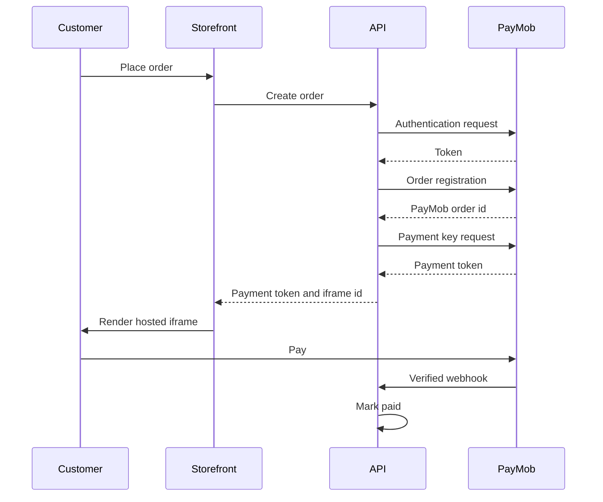
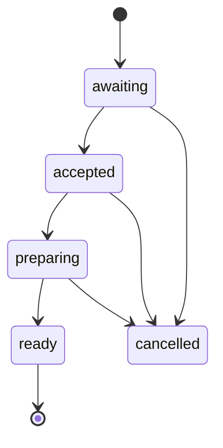

# DESIGN.md

## 1. Product overview

A multi-tenant restaurant ordering and operations platform.

Each tenant is a restaurant business. A tenant can have multiple locations.

The product is a customizable template that can be sold or operated as a service.

## 1.1 Business model decisions

Decided before coding (Phase 0, Order 1 — Define business model):

- **Deployment model: template (per-customer deploy).** Each customer/restaurant gets its own deployed instance and database. The codebase stays multi-tenant-capable: every tenant-scoped table references `restaurant_id` and every location-scoped table references `location_id` (per AGENTS.md), so a future pivot to a single shared multi-tenant SaaS is low-effort. This keeps the door open to monetize later without rework.
- **Monetization: none in V1.** This is a portfolio project. No billing or subscription module is built now. Tenant boundaries remain clean so a subscription or usage-based billing module can be added later without rework.
- **Onboarding: admin/operator-created tenants.** No public self-serve signup in V1. An operator creates the restaurant, its owner account, and the first location (see the "tenant onboarding checklist" task in a later phase).
- **Tenant boundaries:** follow the AGENTS.md isolation rules regardless of per-customer deployment — `restaurant_id` / `location_id` scoping, no cross-tenant data exposure, and all money/totals recalculated server-side.

This is compatible with the multi-tenant architecture described throughout this document; only the deployment topology differs (one instance per customer vs one shared instance), and the code remains tenant-aware either way.

## 2. Design principles

- One API, one core database, optional background workers in the future.
- Server-side pricing, taxes, and totals.
- Tenant isolation on every query.
- Location isolation for staff.
- Immutable order financial data.
- Configurable tax, currency, service charge, printers, kitchen stations, and inventory timing per tenant.
- Idempotent payment webhooks.
- English-only UI in V1, but i18n-ready.

## 3. High-level architecture



## 4. Tenant and location model



- `restaurants` is the top-level tenant boundary.
- `locations` are branches inside a restaurant.
- A user belongs to one restaurant and is assigned to one or more locations.
- All tenant-scoped tables reference `restaurant_id`.
- All branch-scoped tables reference `location_id`.

## 5. Main modules

### 5.1 Tenant and onboarding

- Restaurant creation.
- Tenant owner role.
- Branding:
  - logo.
  - colors.
  - receipt header and footer.
- Currency and timezone.
- Tax registration number.

### 5.2 Locations

- Branch name.
- Address.
- Contact details.
- Active status.
- Receipt branding overrides.
- Inventory deduction setting.
- Kitchen stations.

### 5.3 Auth and RBAC

- Staff email/password.
- Argon2id.
- JWT access and httpOnly refresh.
- Customer guest checkout.
- Customer OTP later.
- RBAC guards.
- Tenant and location guards.

### 5.3.1 V1 role matrix

Roles defined for V1. Role names must **not** be hard-coded in business logic; access is
enforced through a permission/guard layer. `owner` and `admin` are all-locations-capable.

Roles: `owner`, `admin`, `manager`, `shift manager`, `cashier`, `inventory`, `KDS`, `customer`.

| Module | owner | admin | manager | shift manager | cashier | inventory | KDS | customer |
|---|---|---|---|---|---|---|---|---|
| Tenant & locations (settings, branding) | ✓ | ✓ | ✓ | — | — | — | — | — |
| User & role management | ✓ | ✓ | ✓ | — | — | — | — | — |
| Menu (categories, products, modifiers) | ✓ | ✓ | ✓ | ◐ view | ◐ view | ◐ view | ◐ view | — |
| Storefront / online ordering | — | — | — | — | — | — | — | ✓ |
| Orders (create, status, discounts, refunds) | ✓ | ✓ | ✓ | ✓ discount/status | ✓ create/status | — | — | ✓ own |
| Payments (cash, terminal, refund) | ✓ | ✓ | ✓ | ✓ cash/terminal | ✓ cash/terminal | — | — | ✓ own |
| Shifts (open/close) | ✓ | ✓ | ✓ | ✓ | ◐ clock in/out | — | — | — |
| Inventory (items, movements, counts, transfers) | ✓ | ✓ | ◐ view | ◐ view | — | ✓ | — | — |
| Purchase orders (suppliers, receive) | ✓ | ✓ | ◐ view | ◐ view | — | ✓ | — | — |
| KDS (queue, item status) | ◐ view | ◐ view | ◐ view | ◐ view | ◐ view | ◐ view | ✓ | — |
| Reports | ✓ | ✓ | ✓ | ◐ view | — | ◐ view | — | — |
| Settings (tax, currency, printer, stations) | ✓ | ✓ | ✓ | — | — | — | — | — |
| Audit logs (view) | ✓ | ✓ | ✓ | ◐ | — | ◐ | — | — |

Legend: ✓ full access · ◐ view/limited · — none.

Mapping to endpoints follows the access levels already listed in section 15 (API design):
Manager ≈ Manager/Admin endpoints, Cashier ≈ Cashier endpoints, Inventory ≈ Manager/Inventory,
KDS ≈ KDS/Manager, Customer ≈ Public/Customer.

### 5.4 Menu

- Categories.
- Products.
- Modifier groups.
- Modifier options.
- Per-location price.
- Availability.

### 5.5 Storefront

- Tenant resolved by subdomain or slug.
- Public menu.
- Cart.
- Guest checkout.
- Order tracking.

### 5.6 Ordering

- Order types:

```txt
pickup
dine_in
```

- Server-side cart calculation.
- Discounts.
- Taxes.
- Status tracking.

### 5.7 Payments

- PayMob hosted iframe.
- Cash on pickup.
- POS cash.
- POS card terminal.
- Refunds.
- Transaction history.
- Idempotent webhooks.

### 5.8 POS

- Touch product grid.
- Table number for dine-in.
- Split bill.
- Hold and recall.
- Cashier shifts.

### 5.9 Kitchen display

- Configurable stations.
- Item-level tickets.
- Status transitions.
- Automatic refresh.

### 5.10 Receipts and printing

- ESC/POS printers.
- 80/58 mm.
- PDF fallback.
- Print queue and retry.
- Custom receipt branding.

### 5.11 Inventory

- Items with barcode.
- Recipes.
- Stock movements.
- Stock counts.
- Transfers.
- Low-stock alerts.
- Average cost.

### 5.12 Purchase orders

- Suppliers.
- Purchase order creation.
- Receiving with barcode scanning.
- Purchase history.

### 5.13 Settings

Tenant-level settings:

- currency.
- timezone.
- language.
- taxes.
- service charge.
- inventory deduction trigger.
- payment provider.
- printer configuration.
- kitchen stations.

### 5.14 Reports

- Sales.
- Payments.
- Inventory.
- Waste.
- Shifts.
- Tax collected.

## 6. Database model

### Core tenant entities

| Entity | Important fields |
|---|---|
| restaurants | id, name, slug, logo_url, brand_color, default_language, currency, timezone |
| locations | id, restaurant_id, name, address, active, tax_registration_number |
| users | id, restaurant_id, email, password_hash, full_name, role |
| roles | id, restaurant_id, name, permissions |
| user_locations | id, user_id, location_id |
| settings | id, restaurant_id, key, value |

### Menu entities

| Entity | Important fields |
|---|---|
| categories | id, restaurant_id, name, sort_order |
| products | id, restaurant_id, category_id, name, description, image, barcode |
| modifier_groups | id, restaurant_id, product_id, name, min_select, max_select |
| modifier_options | id, modifier_group_id, name, price_delta_minor |
| location_products | id, location_id, product_id, price_minor, is_available |

### Tax entities

| Entity | Important fields |
|---|---|
| tax_rates | id, restaurant_id, name, type, rate_basis_points, is_inclusive |
| location_tax_rates | id, location_id, tax_rate_id, is_active |

### Order and payment entities

| Entity | Important fields |
|---|---|
| orders | id, restaurant_id, location_id, customer_id, order_type, status, total_minor, tax_minor |
| order_items | id, order_id, product_id, product_name, quantity, unit_price_minor |
| order_item_modifiers | id, order_item_id, modifier_option_id, modifier_name, price_delta_minor |
| order_tax_lines | id, order_id, tax_rate_id, tax_name, tax_type, rate_basis_points, amount_minor, is_inclusive |
| payments | id, restaurant_id, order_id, method, status, amount_minor, gateway_reference |
| transactions | id, restaurant_id, payment_id, amount_minor, transaction_type |

### Inventory entities

| Entity | Important fields |
|---|---|
| inventory_items | id, restaurant_id, location_id, name, sku, barcode, unit, stock_quantity, low_stock_threshold |
| product_ingredients | id, restaurant_id, product_id, inventory_item_id, quantity |
| stock_movements | id, restaurant_id, inventory_item_id, location_id, quantity, unit, movement_type, reference_id |
| suppliers | id, restaurant_id, name, email, phone, address |
| purchase_orders | id, restaurant_id, supplier_id, location_id, status, total_minor |
| purchase_order_items | id, purchase_order_id, inventory_item_id, quantity, unit_cost_minor |

### Operations entities

| Entity | Important fields |
|---|---|
| shifts | id, restaurant_id, user_id, location_id, opened_at, closed_at, opening_float_minor, expected_cash_minor |
| print_jobs | id, restaurant_id, location_id, entity_type, entity_id, printer_type, status, payload |
| kitchen_stations | id, restaurant_id, location_id, name, active |
| audit_logs | id, restaurant_id, user_id, action, entity_type, entity_id, metadata |

## 7. Tenant routing

### Public storefront

Two supported modes:

Subdomain:

```txt
acme.chefstack.com
```

Path:

```txt
chefstack.com/r/acme
```

The API accepts either `X-Restaurant-Slug` or a route parameter.

### Staff and POS

Staff tenant is resolved from auth:

```txt
access_token -> restaurant_id
X-Location-Id -> verified location
```

## 8. Order state machine



## 9. Payment state machine



Cash and cash-on-pickup:

```txt
pending -> paid
```

Mixed payments allowed at POS.

## 10. PayMob integration



Important:

- Use hosted iframe.
- Redirect/callback is not proof of payment.
- Webhook is source of truth.
- HMAC signature always verified.
- Webhook must be idempotent.

## 11. Tax engine

- Tax rates belong to a restaurant.
- Optional location overrides.
- Rate types:

```txt
vat
service
other
```

- Inclusive or exclusive.
- Basis points:

```txt
1400 = 14.00%
```

- Immutable tax lines stored on the order.
- Rounding half away from zero.

## 12. Inventory deduction

Tenant setting or location override:

```txt
on_place
on_paid
on_preparing
```

### on_place

Deduct immediately after order placement.

### on_paid

Deduct after successful payment.

### on_preparing

Deduct when kitchen starts preparing.

Cancellation/refund after deduction creates `return_restock`.

## 13. Kitchen display design

Stations configurable per restaurant or location:

```txt
hot
cold
drinks
all
```

Item flow:



KDS receives updates automatically. No page reload.

Order becomes `ready` when all items are ready.

## 14. Receipt design

Printers:

- ESC/POS thermal.
- 80 mm default.
- 58 mm fallback.
- PDF fallback.

Tenant customizable:

- Business name.
- Logo.
- Branch name.
- Address.
- Tax registration number.
- Receipt header and footer.

Print queue:

```txt
pending -> sent | failed -> retry
```

## 15. API design

Base path:

```txt
/api/v1
```

### Tenant and public storefront

| Method | Endpoint | Access |
|---|---|---|
| GET | `/public/:slug/menu` | Public |
| POST | `/public/:slug/orders/guest` | Public |
| GET | `/public/orders/track/:token` | Public |

### Auth

| Method | Endpoint | Access |
|---|---|---|
| POST | `/auth/staff/login` | Public |
| POST | `/auth/staff/refresh` | Public |
| POST | `/auth/staff/logout` | Staff |
| GET | `/auth/me` | Authenticated |

### Admin menu

| Method | Endpoint | Access |
|---|---|---|
| GET | `/admin/categories` | Manager |
| POST | `/admin/categories` | Manager |
| GET | `/admin/products` | Manager |
| POST | `/admin/products` | Manager |
| PATCH | `/admin/products/:id` | Manager |

### Orders

| Method | Endpoint | Access |
|---|---|---|
| POST | `/orders/guest` | Public |
| POST | `/orders/customer` | Customer |
| GET | `/orders/:id` | Customer/Staff |
| POST | `/pos/orders` | Cashier |
| PATCH | `/pos/orders/:id/status` | Cashier/Manager |
| POST | `/pos/orders/:id/pay-cash` | Cashier |
| POST | `/pos/orders/:id/pay-terminal` | Cashier |
| POST | `/pos/orders/:id/apply-discount` | Cashier/Manager |

### Payments

| Method | Endpoint | Access |
|---|---|---|
| POST | `/payments/intent` | Customer/Guest |
| POST | `/payments/webhook/paymob` | PayMob |
| POST | `/payments/:paymentId/refund` | Manager/Admin |

### Inventory

| Method | Endpoint | Access |
|---|---|---|
| GET | `/inventory/items` | Manager/Inventory |
| POST | `/inventory/items` | Manager/Inventory |
| GET | `/inventory/items/lookup/:barcode` | Manager/Inventory |
| POST | `/inventory/stock-movements/manual` | Manager/Inventory |
| POST | `/inventory/stock-counts` | Manager/Inventory |
| POST | `/inventory/transfers` | Manager/Inventory |

### Purchase orders

| Method | Endpoint | Access |
|---|---|---|
| GET | `/suppliers` | Manager/Inventory |
| POST | `/suppliers` | Manager/Inventory |
| GET | `/purchase-orders` | Manager/Inventory |
| POST | `/purchase-orders` | Manager/Inventory |
| POST | `/purchase-orders/:id/receive` | Manager/Inventory |

### KDS

| Method | Endpoint | Access |
|---|---|---|
| GET | `/kds/queues` | KDS/Manager |
| POST | `/kds/items/:id/status` | KDS/Manager |

### Settings

| Method | Endpoint | Access |
|---|---|---|
| GET | `/admin/settings` | Manager/Admin |
| PATCH | `/admin/settings` | Manager/Admin |

### Reports

| Method | Endpoint | Access |
|---|---|---|
| GET | `/reports/sales` | Manager/Admin |
| GET | `/reports/payments` | Manager/Admin |
| GET | `/reports/inventory` | Manager/Admin |
| GET | `/reports/waste` | Manager/Admin |
| GET | `/reports/taxes` | Manager/Admin |

## 16. Security design

- Argon2id.
- Access token in memory on frontend.
- Refresh token in httpOnly cookie.
- Tenant guard everywhere.
- Location guard everywhere.
- PayMob HMAC verification.
- Idempotency on payment webhooks.
- Rate limiting on auth.
- Explicit CORS.
- CSRF protection.
- Audit logs.

## 17. Deployment

### Development

```txt
SQLite + Next.js + NestJS
```

### Production

```txt
PostgreSQL 16 + Next.js + NestJS + Docker + Caddy
```

```mermaid
flowchart LR
  Internet --> Caddy
  Caddy --> Storefront
  Caddy --> POS
  Caddy --> API
  API --> PostgreSQL
  API --> ObjectStorage
  API --> PayMob
  API --> ESCP Printers
  API --> EmailProvider
```

- Subdomain wildcard for tenants if custom domains are configured.
- Nightly PostgreSQL backups.
- `/health` endpoint.
- PayMob webhook publicly reachable.

## 18. Testing strategy

- Unit: money, tax, inventory, printer formatting.
- Integration: all endpoints, tenant isolation, location isolation.
- E2E: guest checkout, POS cash payment, KDS status transitions.
- Payment: PayMob sandbox, webhook idempotency, refunds.

## 19. Future roadmap

- Stripe or other payment adapters.
- Delivery module.
- Loyalty.
- Reservations.
- Custom domains.
- Arabic and other languages.
- Offline POS sync.
- Advanced analytics.
- Barcode label printing.